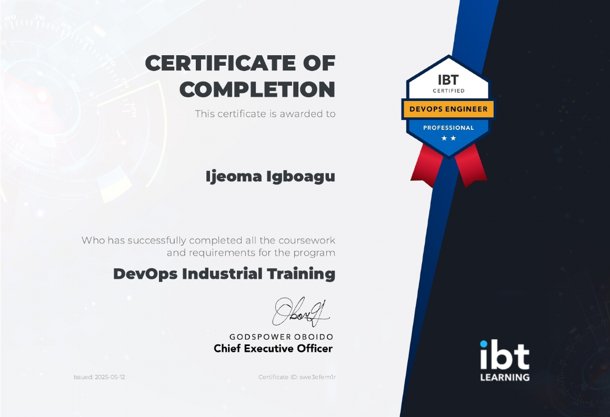

# 🎉 And That’s a Wrap!

Oh yes, it’s officially a wrap for me at IBT African! I’m super grateful to God for the strength to push through — because honestly, just sitting down and staying focused? No be beans! 😅
They say health is wealth, true talk.

## 🧡 Big Congrats, Ijay!🫂

You did it!!! You’re now a DevOps Engineer! I’m super proud of you.

Thanks to [IBT Learning](https://ibtlearning.africa/) and everyone who made this opportunity possible. 🙏

And guess what? Our tutor [@ooghenekaro](https://github.com/ooghenekaro) didn’t just teach and go — he was so intentional, he gave us extra demo work to practice our DevOps skills. (Don’t worry, go with your pace; I’ve still got mine to finish. 😅)

The journey was real. The growth? Even realer.

Let’s go build, deploy, and automate everything! 🚀

